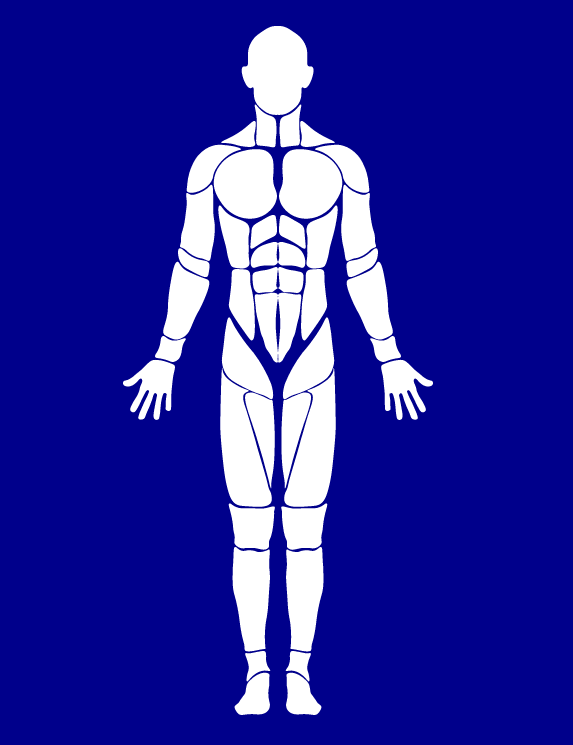

# @darshanpatel2608/human-body-react

Build one Human Body figure inyour web Page using React.
Show the parts you want and click on them to select it.



## Props

<table>
<tr>
  <th>Name</th>
  <th>Type</th>
  <th>Description</th>
  <th>Default</th>
</tr>
<tr>
  <td>partsInput</td>
  <td>object</td>
  <td>Parts Parameters</td>
  <td>None</td>
</tr>
<tr>
  <td>onChange</td>
  <td>function</td>
  <td>Function trigger on change in parts, gives one argument parts</td>
  <td>None</td>
</tr>
<tr>
  <td>onClick</td>
  <td>function</td>
  <td>Function trigger on click in parts, gives one argument id of clicked part</td>
  <td>None</td>
</tr>
<tr>
  <td>mode</td>
  <td>string</td>
  <td>missing | pain, Mode of operation: missing mode is smart mode</td>
  <td>pain</td>
</tr>
<tr>
  <td>height</td>
  <td>string</td>
  <td>Height of body div</td>
  <td>510px</td>
</tr>
<tr>
  <td>width</td>
  <td>string</td>
  <td>Width of body div</td>
  <td>207px</td>
</tr>
</table>

## Parts Params

<table>
  <tr>
    <th>Name</th>
    <th>Type</th>
    <th>Description</th>
    <th>Default</th>
  </tr>
  <tr>
    <td>selected</td>
    <td>boolean</td>
    <td>Body Part is selected or not</td>
    <td>false</td>
  </tr>
  <tr>
    <td>clickable</td>
    <td>boolean</td>
    <td>Body Part can be selected or not</td>
    <td>true</td>
  </tr>
  <tr>
    <td>show</td>
    <td>boolean</td>
    <td>Body Part is visible or not</td>
    <td>true</td>
  </tr>
  <tr>
    <td>custom values</td>
    <td>any</td>
    <td>Any other value param to be used (can be retrived with onChange)</td>
    <td>...</td>
  </tr>
</table>

## Body Parts 

<table>
  <tr>
    <td>head</td>
    <td>chest</td>
    <td>stomach</td>
    <td>left_shoulder</td>
  </tr>
  <tr>
    <td>left_arm</td>
    <td>left_hand</td>
    <td>right_shoulder</td>
    <td>left_leg_lower</td>
  </tr>
  <tr>
    <td>right_arm</td>
    <td>right_hand</td>
    <td>left_leg_upper</td>
    <td>left_foot</td>
  </tr>
  <tr>
    <td>right_leg_upper</td>
    <td>right_leg_lower</td>
    <td>right_foot</td>
  </tr>
</table>


## How to use it

```tsx
const exampleParams = {
  head: { selected: true },
  left_arm: { show: false }
}

export const App: VFC = () => {
  const [params, setParams] = useState<any>()
  return (<div>
      <BodyComponent partsInput={params} />
    )}
  </div>
  )
}
```


<h1>By: Darshan Patel</h1>
<h4>LinkedIN: <a href="https://www.linkedin.com/in/darshan-patel-2608" >Darshan Patel</a></h4>