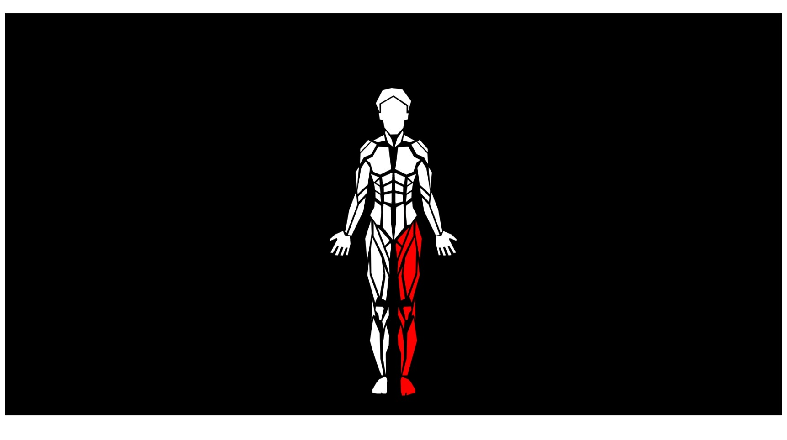

# @darshanpatel2608/human-body-react

Build one Human Body figure inyour web Page using React.
Show the parts you want and click on them to select it.




## How to use it

```tsx
const exampleParams = {
  head: { selected: true },
  left_arm: { show: false }
}

export const App: VFC = () => {
  const [params, setParams] = useState<any>()
  return (<div>
      <BodyComponent partsInput={params} />
    )}
  </div>
  )
}
```

## TODO

* Individual Protection Equipment (helmet...)


Thanks to:
* https://github.com/volcanioo/Human-Body-Rendering-HTML<br/>
* https://github.com/mariohmol/reactjs-human-body

<h1>By: Darshan Patel</h1>
<h4>LinkedIN: <a href="https://www.linkedin.com/in/darshan-patel-2608" >Darshan Patel</a></h4>